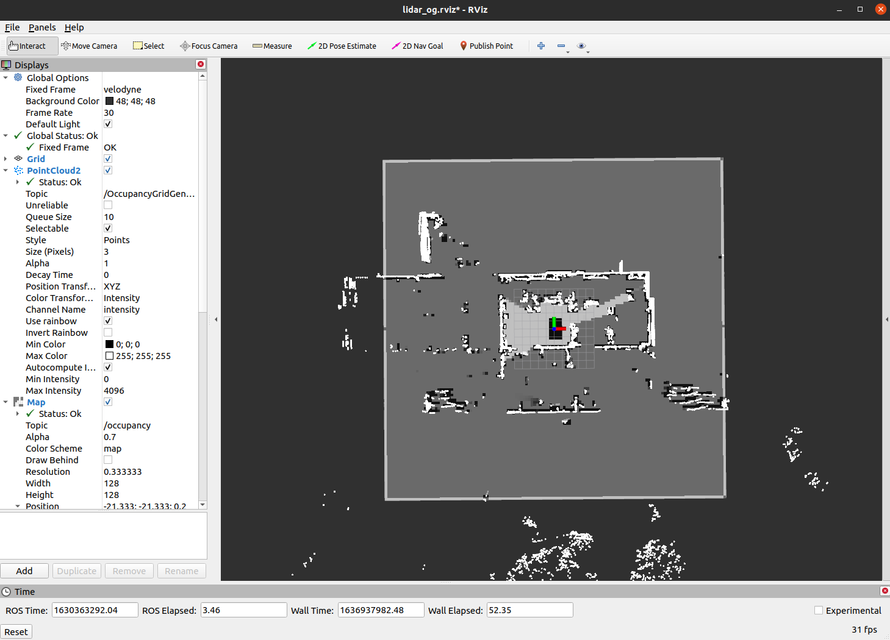

# ROS Occupancy Grid Perception

This package contains ROS C++ Occupancy Grid Perception framework which includes point cloud preprocessing, ground segementation, and occupancy grid generation. The pipeline follows the approach defined by Itkina et al. [1]. This package does not contain any rosbags.

## ROS Lidar pointcloud compatibility

To ensure the compatibility with other rosbag, the raw Lidar pointcloud topics needs to be renamed in the aggregate_points.cpp to match the topics and the number of Lidar sensors in the rosbag. The type of message used to represent the Lidar pointcloud and all other messages are defined in occupancy_grid_msgs. 

## How to run it?

1. Adapt the topics in aggregate_points.cpp

2. Launch the following file: 
  ```bash
  roslaunch lidar_pkg launch_all.launch 
  ```  
3. In a different terminal, start a rosbag of your choice. Ensure that the naming convention of the topics is correct.
  
  ```bash
  rosbag play --clock path/to/the/rosbag
  ```

## Example of the rviz visualization



## Experiments 

Tested on:
- Ubuntu 20.04
- ROS Noetic
- Intel i9-9900KF


## Acknowledgements 
The authors would like to acknowledge this project being made possible by the funding from the Ford-Stanford Alliance. The authors thank Stanford Dynamic Design Lab for providing Lidar processing stack.

Maintained by [Bernard Lange](https://web.stanford.edu/~blange/)

## References

[1] Itkina, M., Driggs-Campbell, K. and Kochenderfer, M.J., 2019, Dynamic Environment Prediction in Urban Scenes using Recurrent Representation Learning. In IEEE Intelligent Transportation Systems Conference (ITSC), pp. 2052-2059.
